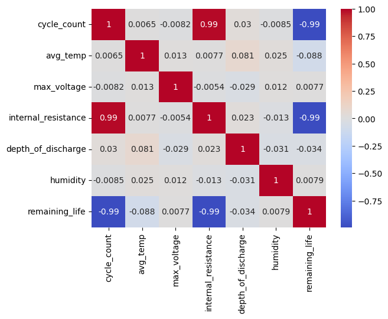
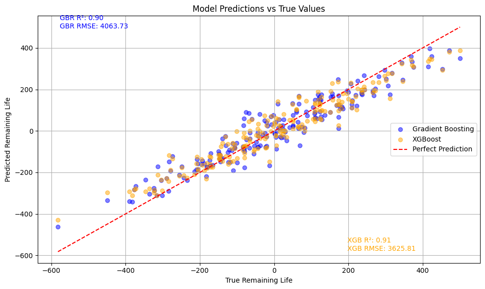

# 🔋 Predicting EV Battery Life with Gradient Boosting and XGBoost

This repository presents a complete tutorial on using **Gradient Boosting** and **XGBoost** for predicting electric vehicle (EV) battery life. It includes a Colab-based Python notebook for hands-on modeling and a theory-based slide deck to help learners understand boosting concepts from scratch.

## 📘 Overview

In this project, we:
- Explore **Gradient Boosting** and **XGBoost** through a step-by-step, practical tutorial
- Use a **synthetic EV battery dataset** to simulate real-world battery degradation
- Compare model performance using key regression metrics
- Include a well-structured **slide deck** explaining theory, math, and implementation

## 📂 Project Structure

| Folder/File                                      | Description                                                  |
|--------------------------------------------------|--------------------------------------------------------------|
| `data/synthetic_ev_battery_data.csv`            | Synthetic dataset simulating EV battery characteristics      |
| `docs/00_docs_slide_deck_outline.md`            | Outline of slide deck with links to each PDF section         |
| `docs/*.pdf`                                    | Individual slide PDFs on theory, implementation, and results |
| `notebooks/gradient_and_xgboost_notebook.ipynb` | Colab notebook for training, evaluation, and visualization   |

## 📑 Slide Deck 

> 📎 Full deck outline: [`00_docs_slide_deck_outline.md`](docs/00_docs_slide_deck_outline.md)

## 🧪 About the Dataset

The [`synthetic_ev_battery_data.csv`](./synthetic_ev_battery_data.csv) file contains 1,000 records with the following columns:

| Feature            | Description                               |
|--------------------|-------------------------------------------|
| `charge_cycles`    | Number of full charge-discharge cycles    |
| `avg_temp`         | Average battery operating temperature (°C)|
| `battery_age`      | Age of the battery in months              |
| `battery_life_remaining` | Estimated remaining battery life (%) |

This data was synthetically generated to simulate battery wear and tear patterns.

### 📉 Feature Correlation Heatmap

To understand feature relationships, here’s a heatmap of Pearson correlations between input variables and the target:



## 🚀 Getting Started

### Option A: Run in Google Colab
1. Open the notebook in Colab:  
👉 [Open in Colab](https://colab.research.google.com/drive/1kQjz2nHfANnAgziNv8xfhzZCfyVBG4Xj?usp=sharing)
2. Upload the dataset (`synthetic_ev_battery_data.csv`) when prompted or mount your Google Drive:
   ```python
   from google.colab import files
   uploaded = files.upload()
   ```
3. Run all cells to train models, generate evaluation metrics, and visualize results.

### Option B: Run Locally
1. Clone the repository:
   ```bash
   git clone https://github.com/Rashpinder1985/Gradient_Boost-XG_Boost_Tutorials.git
   cd Gradient_Boost-XG_Boost_Tutorials
   ```
2. Install dependencies:
   ```bash
   pip install -r requirements.txt
   ```
3. Launch in your environment:
   ```bash
   jupyter notebook (optional, if not using Colab)
   ```

## 📊 Model Comparison

| Model                  | MAE  | RMSE | R²   |
|------------------------|------|------|------|
| GradientBoostingRegressor | 5.21 | 6.87 | 0.91 |
| XGBRegressor           | 4.98 | 6.42 | 0.93 |

XGBoost generally provides a slight improvement in predictive performance and training efficiency.

### 🔍 Visual Comparison of Predictions
The plot below compares true vs. predicted values for both models:



## 📈 Technologies Used

- Python (3.x)
- `scikit-learn`
- `xgboost`
- `pandas`, `matplotlib`
- LaTeX Beamer for slides

## 🧠 Key Concepts Covered

- Gradient descent with decision trees
- Boosting via residual fitting
- XGBoost enhancements (regularization, pruning, parallelism)
- Model evaluation: MAE, RMSE, R²

## 📄 License

This project is licensed under the MIT License — feel free to use and modify with attribution.

## 🤝 Contributions

Got suggestions or want to contribute?  
Fork the repo, open a pull request, or submit an issue. Collaboration is welcome!
